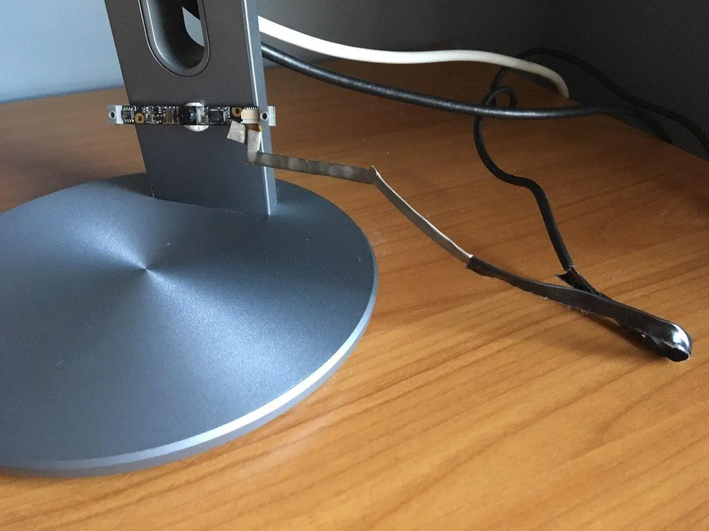

# Hacking laptops

This repo contains some resources I found on the internet about repairing, modding or reusing old laptops. All links were added to the internet archive (except github).

## TL;DR

- most old laptops use custom LVDS implementation for display connection, easiest way is to buy a LVDS converter for your LCD panel (look for model number and google) and connect via HDMI
- newer laptops use eDP for displays
- all laptops use custom keyboard connection using the FPC tape, you need to create a board that will convert signal from keyboard to usb to make use of it

## Keyboard

- https://www.instructables.com/How-to-Make-a-USB-Laptop-Keyboard-Controller/
- https://hackaday.com/2018/12/04/teensy-liberates-the-thinkpad-keyboard/
- https://superuser.com/questions/184870/laptops-internal-keyboard-as-an-external-one
- https://github.com/thedalles77/USB_Laptop_Keyboard_Controller

## Display

- https://www.laptopscreen.com/English/section/Articles/1245191276/Screen%20connector/
- https://emerythacks.blogspot.com/2013/04/connecting-ipad-retina-lcd-to-pc.html
- https://hackaday.com/2019/07/18/put-those-ipad-displays-to-work-with-this-edp-adapter/
- https://hackaday.com/2019/07/31/open-source-smart-display-takes-the-long-way-around/#more-369171
- https://www.raspberrypi.org/forums/viewtopic.php?f=45&t=157109&sid=bdcedc42198123ad07dd8de56abe83ad

## Webcam

Webcams are connected with USB, so you can just resolder them to old usb plug. Here's mine:

## Other

### MNT Reform - open source hardware laptop

https://mntre.com/reform

### Raspberry Compute Module custom board

I had this idea if you could reuse old thinkpads by replacing motherboards with custom raspberry pi.
Sounds hard but doable, and also very very cooool. contact me if you have thoughts.

- https://github.com/ShawnHymel/rpi-cm4-base-carrier
- https://github.com/ShawnHymel/rpi-cm4-carrier-template
